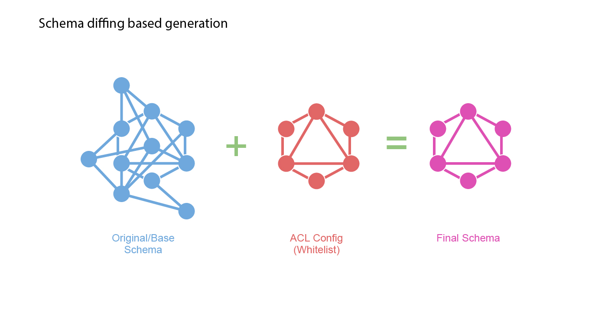
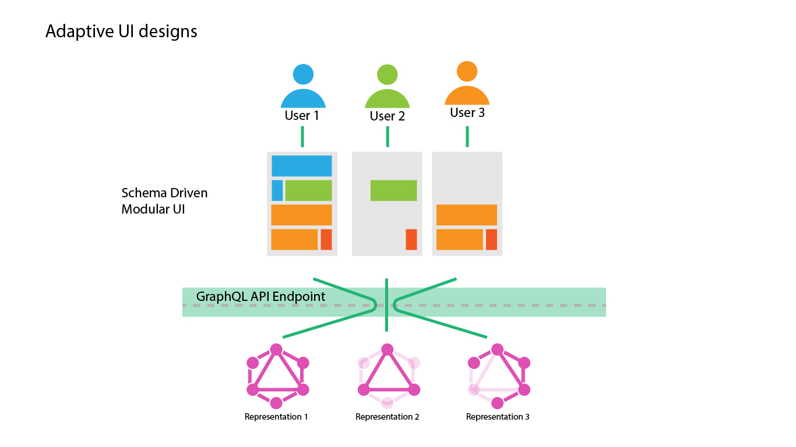
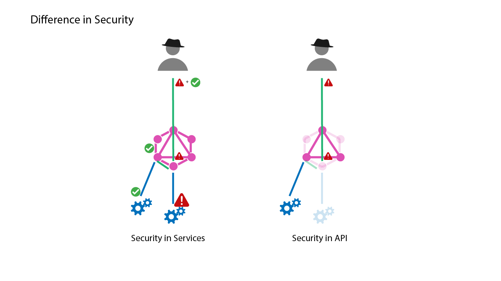

# Schema Diffing for Authorization

This approach can be likened to an API Gateway as the core concept here is that people can only access resources that they are authorized to, and unauthorized access is blocked off in the API itself.

## Problems addressed by this approach
* Allow clients to identify resources they are authorized to access, by introspecting the schema.
* Implement blanket authorization where business logic layer is not under the control of the API.
* Limit information disclosure without degrading developer experience.
* Clear separation of authorization logic from business logic.
  * As authorization happens in a separate layer, the business logic can focus on it's operations.

## Comparison with Authorization in Business Logic Layer
It makes sense to implement authorization in Business Logic Layer below the API/GraphQL layer as that would allow you to use the same authorization logic for access methods other than API. However this approach makes it difficult to allow the accessors/client to determine what they have access to, and many times the only way for a client to do so is by hitting an end point and then observing the respons.

## How to perform schema diffing?
In the API/GraphQL layer of execution we perform the following operations:

1. Obtain an authorization mask from an auth provider for the user's context.
2. Modify the schema by applying the authorization mask.
   1. Start with a blank schema.
   2. For each node and parameter in the authorization mask, copy over the node from original schema if it exists.
3. Continue with Request Execution.

## Advantages of this approach

1. Business logic and other services can implement or not their own authorization, as main authorization can be controlled by teams responsible for security.
   1. This empowers the security team to implement best practices in a domain disjoint from developers and allows the work to be done parallely.
   2. Forensics can be performed at the API layer, instead of having to drill down to potentially 3rd party APIs.
2. UIs can be implemented as slaves to the presented schema, modules that a particular user does not have access to can be removed from the UI by introspecting the schema.

1. Execution time can be minimized by eliminating requests made to data points that will end up resulting in errors about unauthorized access.
2. Different clients can be implemented with access to only certain parts of the business without exposing the entire business graph to them.
3. Does not degrade the developer experience by forcing to turn off schema introspection for hiding the unauthorized nodes.
4. Eliminates the possibility of graph traversal from unauthorized nodes.

## Considerations

While implementing, the following factors should be considered.

### Performance
We should apply an authorization mask and cache the schema associated with that mask and on subsequent requests associated with the mask simply fetch the schema removing any performance degradation caused by masking logic.

As an additional benefit, nodes that are not authorized will not be executed as the request executor will not invoke the requests since they will not appear on the schema. This would improve the performance by minimizing execution compared to implementations in which the requests need to be executed until the business logic layer responds with errors regarding unauthorized access.

### Generation of Authorization Mask
While the authorization mask is generated we might disable certain nodes which would break the schema as we might have orphan edges on different nodes pointing to the node which has been masked out.

This can be addressed by providing mask generators with a schema validation check and subsequently masking out the orphan edges.

### Unexpected responses
As a client might develop an application thinking of the entire schema being available, while their users may have limited access and receive incomplete responses.

This can be addressed by checking for null responses on the client as is the standard and from the server responding with an unauthorized access error message if needed.

### Auditing malicious users vs poorly designed clients
We will now be hitting unauthorized requests in 2 cases,

   1. A malicious user tries to hit the nodes which have not been exposed in the presented schema.
   2. A client has hard coded requests that will try to obtain all nodes regardless of whether the accessing user is presented with all the relevant nodes in the schema or not.

We can look at the problem generally as trying to distinguish a maliciously crafted request accessing deprecated nodes vs an old client accessing deprecated nodes. This problem needs to be addressed on a case-by-case basis in forensics stage where a certain amount of contextual data, not necessarily related to GraphQL's request itself will be key in differentiating between the two. As it stands, we do not have a solution to this problem.
